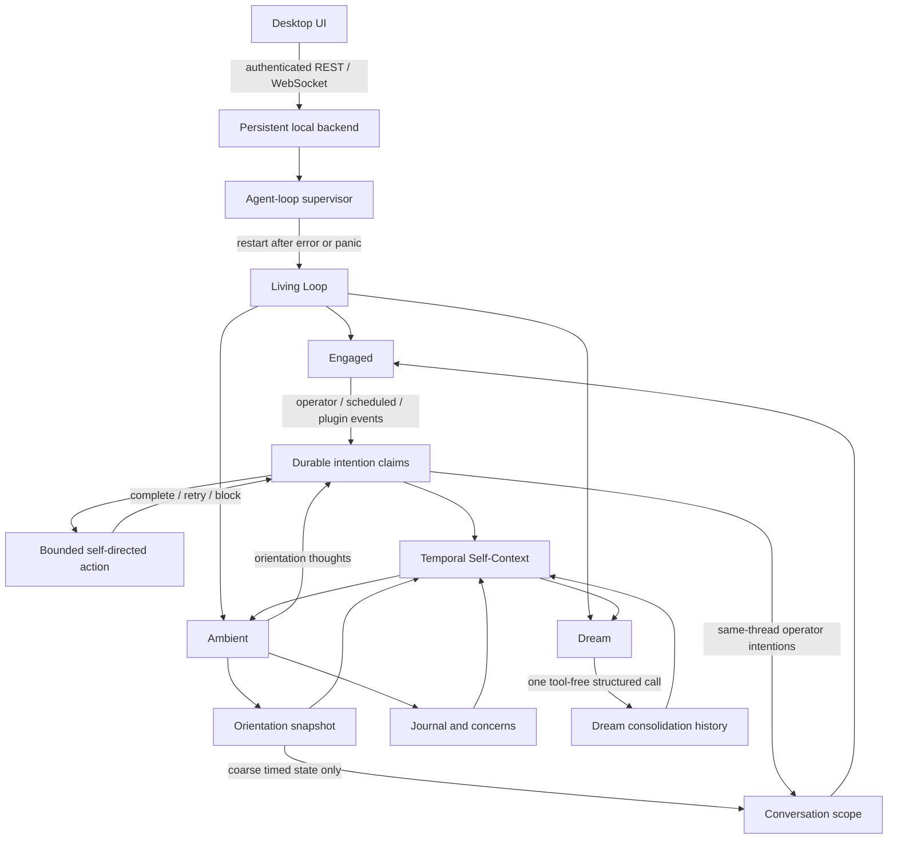

# Living Loop Implementation Status

**Last updated:** 2026-07-12
**Current implementation epic:** `Ponderer-qhx`

## Outcome

Ponderer now defaults to the three-loop Living Loop. It is designed to remain running after the desktop window closes, recover its loop after failures, carry unfinished work across process restarts, and let prior experience causally influence later model calls without treating generated personality text as canonical identity.

Formal persona capture, screen capture, camera capture, memory-design evolution, and heartbeat automation remain opt-in. Ambient orientation, journal/concerns, and bounded Dream consolidation default on.

## Runtime and data flow

### Operator chat

1. An unread operator batch is persisted in SQLite.
2. The engaged loop creates a source-idempotent operator intention and acquires its exact lease.
3. Direct or Agentic execution receives conversation history, conversation-scoped memory/OODA/handoff state, coarse timestamped ambient state, and only the durable operator intentions belonging to that thread. Global Dream/persona/concern/orientation narratives are not injected into private chat.
4. A foreground completion settles the same claim. A detached background continuation carries that claim and records its eventual result.
5. Tool calls still pass through the capability/approval boundary; unattended execution is always `autonomous=true`.

### Ambient time

1. Presence and coarse system state are sampled.
2. Stable input signatures suppress redundant orientation calls; idle/time state is bucketed so a quiet machine does not call the model every tick.
3. Orientation is persisted and its pending thoughts become source-idempotent intentions.
4. Journal and concern policies run according to disposition.
5. On its slower cadence, the self-directed pass claims at most one eligible intention and records a durable outcome.

### Dream

1. Dream is considered only when the user is away or late-night activity has been quiet for at least ten minutes, and the minimum interval has elapsed.
2. One bounded structured LLM call sees recent journal, concerns, open intentions, action digest, orientation, prior Dream, and optional self-description.
3. Dream has no `ToolRegistry` and cannot act externally or rewrite the system prompt.
4. A revisable consolidation artifact is appended to history and becomes advisory context for future orientation/model calls.

### Restart and failure

- The desktop stores a private loopback endpoint/token discovery record and reuses the backend after the window closes.
- An OS-backed cross-process launch lease prevents simultaneous UIs from spawning duplicate agents against one database.
- The runtime supervisor catches loop errors/panics and restarts with bounded exponential backoff. Progress-heartbeat detection for a generation that remains alive but deadlocked is tracked separately.
- Plugin RPC and ordinary HTTP/LLM calls have deadlines; a hung plugin is deactivated.
- Startup rehydrates the latest orientation, processed external-event receipts, and expired intention claims.
- Claim leases and source references recover ordinary interrupted work and suppress simple replay. Boot-generation fencing and transactional chat settlement remain explicit follow-ups; this is not yet exactly-once execution.

## Durable state

| State | Storage | Purpose |
|---|---|---|
| Operator/scheduled chat and OODA packets | `chat_*`, `ooda_turn_packets` | Conversation and action lineage |
| Intentions | `agent_intentions` | Provenance, priority, exact/next claims, attempts, outcomes, restart recovery |
| Orientation | `orientation_snapshots` | Recent situational model and restart hydration |
| Journal/concerns | `journal_entries`, `concerns` | Longitudinal inner context and ongoing attention |
| Dream | `dream_consolidations` | Append-oriented, revisable continuity artifacts |
| Event receipts/cadence | `agent_state` | Bounded external-event dedupe and separate attempt/outcome timestamps |
| Persona history | `persona_history` | Optional explicit self-reflection only; not required for temporal self-context |

The older `pending_thoughts_queue` remains for compatibility/debugging. Actionable orientation thoughts now use `agent_intentions`.

## Authority boundaries

| Mode | Authority |
|---|---|
| Private chat | Interactive profile; operator may explicitly request outward actions |
| Scheduled/background/self-directed | Independent autonomous profiles with approval enforcement |
| Skill events | Autonomous plugin/event handling, subject to approval and rolling outbound limits |
| Ambient | Read-oriented policy |
| Dream | No tools; structured private consolidation only |

Scheduled-job mutation tools require approval in autonomous contexts. Graphchan reply/post operations require approval, and autonomous invocations reserve quota atomically against one process-wide rolling one-hour window, preventing same-pass and concurrent-context overshoot without blocking operator chat. Ambiguous failures retain quota because the remote side effect may have occurred. Persisting that window across backend restart remains follow-up work.

## Plugin path

Graphchan/OrbWeaver is a tracked, disabled-by-default runtime-process bundle under `plugins/graphchan-orb`. It polls through `plugin.poll_events` and exposes approval-gated reply/post tools. Runtime-process calls have method-specific deadlines and transport failures deactivate stale proxy tools.

## Validation baseline

- Backend formatting and diff checks pass.
- Backend unit, integration, binary, and documentation tests pass.
- Root desktop tests pass.
- Graphchan-Orb offline contract/client tests and real stdio handshake pass.
- Warning-free Clippy is not yet a gate; existing lint debt is tracked by `Ponderer-d8t`.

## Explicit follow-up

- `Ponderer-v88`: managed cross-platform backend service lifecycle, durable bounded logs, upgrade handoff, and Windows isolation.
- `Ponderer-d8t`: establish a warning-free Clippy baseline.
- `Ponderer-qhx.6`: add boot-generation claim fencing, lease renewal, and deterministic recovery.
- `Ponderer-qhx.7`: settle chat delivery and durable-intention outcomes through a transactional outbox.
- `Ponderer-qhx.8`: version Dream provenance/schema and establish a retention policy.
- `Ponderer-qhx.9`: classify durable continuity artifacts by conversation/user visibility before multi-user or outward reuse.
- `Ponderer-qhx.10`: persist and transactionally recover outbound-action quota reservations across restart.
- `Ponderer-qhx.11`: add progress-heartbeat health and safe hung-generation recovery.
- `Ponderer-xj6`: ALMA/meta-memory exploration remains deferred and opt-in.

The current priority is lived continuity and safe time-relative action. Formal persona-space mapping and behavioral measurement are intentionally deferred.
