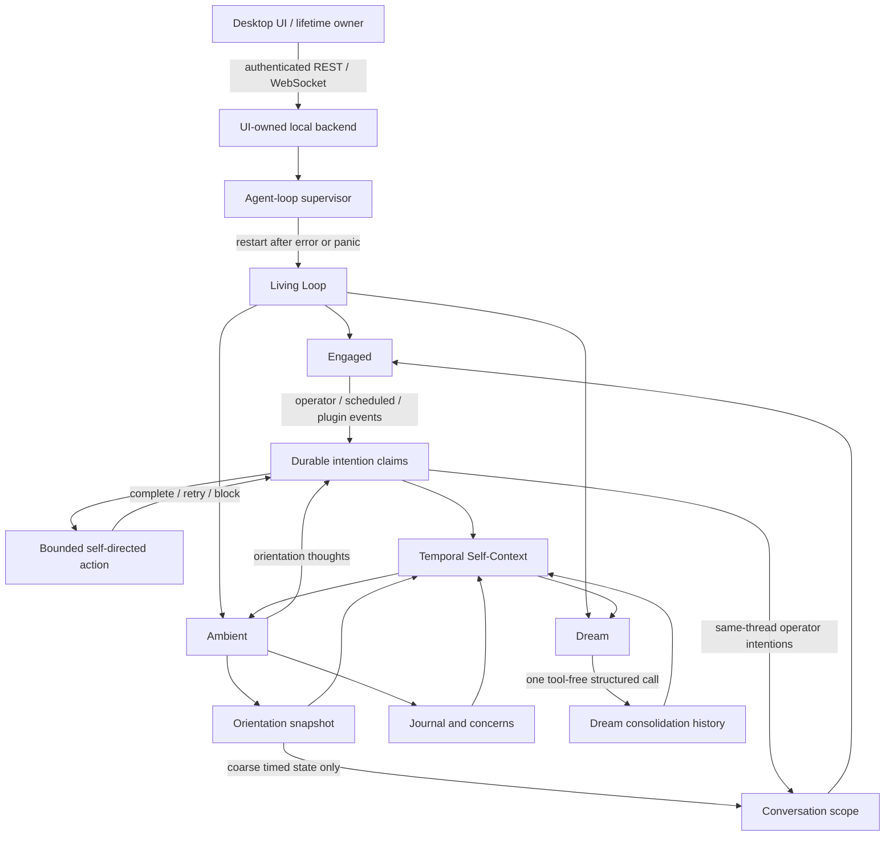

# Living Loop Implementation Status

**Last updated:** 2026-09-30
**Current implementation epic:** `Ponderer-qhx`

## Outcome

Ponderer defaults to the three-loop Living Loop. While its owning desktop UI is open, it can reflect, pursue bounded goals, and choose to contact its operator without a chat prompt. Closing or losing that UI stops the backend, including cognition and Telegram. This is an intentional safeguard: there is no installed service, and the former persistent-lifetime environment override is ignored. Durable state resumes when the UI is opened again.

The continuity appraisal separates operator-owned identity (agent name, operator name, relationship, principles, boundaries) from evidence-backed learned claims. Claims can be revised by ID, with confidence, supporting and opposing evidence; drives decay rather than growing from unanswered messages. Self-directed action outcomes and explicit contact feedback become evidence for later appraisal, orientation, self-directed work and Dream.

One structured, tool-free appraisal chooses silence, local chat, send, defer, or discard, and may adopt one grounded self-authored goal. It selects its next reconsideration time (60–3600 seconds); changed evidence can wake appraisal sooner, with a one-minute model-call floor. Waking never mandates contact. The old two-/four-hour social-message trigger and direct Surface/Interrupt publication paths are removed.

All spontaneous messages pass through durable quiet hours, confidence, rolling daily quota, minimum spacing, exact normalized topic dedupe, busyness, and expiry checks. Defaults: three messages per rolling day, at least one hour apart, quiet 22:00–08:00 local time, no quiet-hour urgency bypass. A dismissal reduces the daily allowance to one for 24 hours. No feedback means unknown reception, not rejection. Semantic novelty is not guaranteed by exact topic dedupe.

Telegram requires both a bot token and positive private owner chat ID; chat type and sender must match. Inbound receipts, conversation-scoped replies and a transactional outbox survive restarts. Receiver and sender are independent futures inside one supervised task. Only explicit provider receipts mark delivery confirmed; an interrupted/ambiguous send becomes uncertain, is not blindly retried, and retains its contact-budget reservation. Pause prevents new delivery claims (already-started network requests cannot be recalled). Long replies are split without truncating, and private metadata blocks are removed.

The authenticated `GET /v1/agent/continuity` endpoint exposes learned state, the latest decision/next wake, and recent contact outcomes. `POST /v1/agent/contacts/:id/feedback` accepts `{"feedback":"welcomed"}` or `{"feedback":"dismissed"}`; Telegram outreach includes equivalent buttons. Settings → General configures identity, owner credentials and contact limits.

Linux presence uses bounded probes. Wayland uses session idle hints when published; missing signals remain unknown. Chat silence is not substituted for desktop inactivity. Screen and camera access remain separately opt-in.

Formal persona capture, screen capture, camera capture, memory-design evolution, and heartbeat automation remain opt-in. Ambient orientation, journal/concerns, and bounded Dream consolidation default on.

## Runtime and data flow

```mermaid
flowchart TD
    UI["Desktop UI / lifetime owner"] -->|"authenticated REST / WebSocket"| API["UI-owned local backend"]
    API --> SUP["Agent-loop supervisor"]
    SUP -->|"restart after error or panic"| LOOP["Living Loop"]

    LOOP --> ENG["Engaged"]
    LOOP --> AMB["Ambient"]
    LOOP --> DRM["Dream"]

    ENG -->|"operator / scheduled / plugin events"| CLAIM["Durable intention claims"]
    AMB -->|"orientation thoughts"| CLAIM
    CLAIM --> SELF["Bounded self-directed action"]
    SELF -->|"complete / retry / block"| CLAIM

    AMB --> ORI["Orientation snapshot"]
    AMB --> JRN["Journal and concerns"]
    DRM -->|"one tool-free structured call"| DART["Dream consolidation history"]

    ORI --> CTX["Temporal Self-Context"]
    JRN --> CTX
    DART --> CTX
    CLAIM --> CTX
    CTX --> AMB
    CTX --> DRM

    ORI -->|"coarse timed state only"| SCOPE["Conversation scope"]
    CLAIM -->|"same-thread operator intentions"| SCOPE
    SCOPE --> ENG
```

### Operator chat

1. An unread operator batch is persisted in SQLite.
2. The engaged loop creates a source-idempotent operator intention and acquires its exact lease.
3. Direct or Agentic execution receives conversation history, conversation-scoped memory/OODA/handoff state, coarse timestamped ambient state, and only the durable operator intentions belonging to that thread. Global Dream/persona/concern/orientation narratives are not injected into private chat.
4. A foreground completion settles the same claim. A detached background continuation carries that claim and records its eventual result.
5. Tool calls still pass through the capability/approval boundary; unattended execution is always `autonomous=true`.

### Ambient time

1. Presence and coarse system state are sampled.
2. Stable input signatures suppress redundant orientation calls; idle/time state is bucketed so a quiet machine does not call the model every tick.
3. Orientation is persisted and its pending thoughts become source-idempotent intentions.
4. Journal and concern policies run according to disposition.
5. On its slower cadence, the self-directed pass claims at most one eligible intention and records a durable outcome.

### Dream

1. Dream is considered only when the user is away or late-night activity has been quiet for at least ten minutes, and the minimum interval has elapsed.
2. One bounded structured LLM call sees recent journal, concerns, open intentions, action digest, orientation, prior Dream, and optional self-description.
3. Dream has no `ToolRegistry` and cannot act externally or rewrite the system prompt.
4. A revisable consolidation artifact is appended to history and becomes advisory context for future orientation/model calls.

### Restart and failure

- The desktop stores a private loopback endpoint/token discovery record and reuses the backend after the window closes.
- An OS-backed cross-process launch lease prevents simultaneous UIs from spawning duplicate agents against one database.
- The runtime supervisor catches loop errors/panics and restarts with bounded exponential backoff. Progress-heartbeat detection for a generation that remains alive but deadlocked is tracked separately.
- Plugin RPC and ordinary HTTP/LLM calls have deadlines; a hung plugin is deactivated.
- Startup rehydrates the latest orientation, processed external-event receipts, and expired intention claims.
- Claim leases and source references recover ordinary interrupted work and suppress simple replay. Boot-generation fencing and transactional chat settlement remain explicit follow-ups; this is not yet exactly-once execution.

## Durable state

| State | Storage | Purpose |
|---|---|---|
| Operator/scheduled chat and OODA packets | `chat_*`, `ooda_turn_packets` | Conversation and action lineage |
| Intentions | `agent_intentions` | Provenance, priority, exact/next claims, attempts, outcomes, restart recovery |
| Orientation | `orientation_snapshots` | Recent situational model and restart hydration |
| Journal/concerns | `journal_entries`, `concerns` | Longitudinal inner context and ongoing attention |
| Dream | `dream_consolidations` | Append-oriented, revisable continuity artifacts |
| Event receipts/cadence | `agent_state` | Bounded external-event dedupe and separate attempt/outcome timestamps |
| Persona history | `persona_history` | Optional explicit self-reflection only; not required for temporal self-context |
| Learned continuity | `self_claims`, `agent_drives`, `lived_outcomes` | Revisable beliefs, decaying priorities and observed outcomes |
| Appraisal decisions | `continuity_decisions` | Decision plus immutable evidence snapshot and next wake |
| Communication | `communication_intents`, `delivery_outbox`, `connector_receipts` | Chosen contact, policy reservation, provider outcome and inbound dedupe |

The older `pending_thoughts_queue` remains for compatibility/debugging. Actionable orientation thoughts now use `agent_intentions`.

## Authority boundaries

| Mode | Authority |
|---|---|
| Private chat | Interactive profile; operator may explicitly request outward actions |
| Scheduled/background/self-directed | Independent autonomous profiles with approval enforcement |
| Skill events | Autonomous plugin/event handling, subject to approval and rolling outbound limits |
| Ambient | Read-oriented policy |
| Dream | No tools; structured private consolidation only |

Scheduled-job mutation tools require approval in autonomous contexts. Graphchan reply/post operations require approval, and autonomous invocations reserve quota atomically against one process-wide rolling one-hour window, preventing same-pass and concurrent-context overshoot without blocking operator chat. Ambiguous failures retain quota because the remote side effect may have occurred. Persisting that window across backend restart remains follow-up work.

## Plugin path

Graphchan is a tracked, disabled-by-default protocol-v1 package under `plugins/graphchan-orb`. It uses the shared Python SDK, polls through `plugin.poll_events`, and declares `external.publish` effects on reply/post tools so host policy supplies approval and quota gates.

## Validation baseline

- Backend formatting and diff checks pass.
- Backend unit, integration, binary, and documentation tests pass.
- Root desktop tests pass.
- Graphchan-Orb offline contract/client tests and real stdio handshake pass.
- Warning-free Clippy is not yet a gate; existing lint debt is tracked by `Ponderer-d8t`.

## Explicit follow-up

- `Ponderer-v88`: managed cross-platform backend service lifecycle, durable bounded logs, upgrade handoff, and Windows isolation.
- `Ponderer-d8t`: establish a warning-free Clippy baseline.
- `Ponderer-qhx.6`: add boot-generation claim fencing, lease renewal, and deterministic recovery.
- `Ponderer-qhx.7`: settle chat delivery and durable-intention outcomes through a transactional outbox.
- `Ponderer-qhx.8`: version Dream provenance/schema and establish a retention policy.
- `Ponderer-qhx.9`: classify durable continuity artifacts by conversation/user visibility before multi-user or outward reuse.
- `Ponderer-qhx.10`: persist and transactionally recover outbound-action quota reservations across restart.
- `Ponderer-qhx.11`: add progress-heartbeat health and safe hung-generation recovery.
- `Ponderer-xj6`: ALMA/meta-memory exploration remains deferred and opt-in.

The current priority is lived continuity and safe time-relative action. Formal persona-space mapping and behavioral measurement are intentionally deferred.
