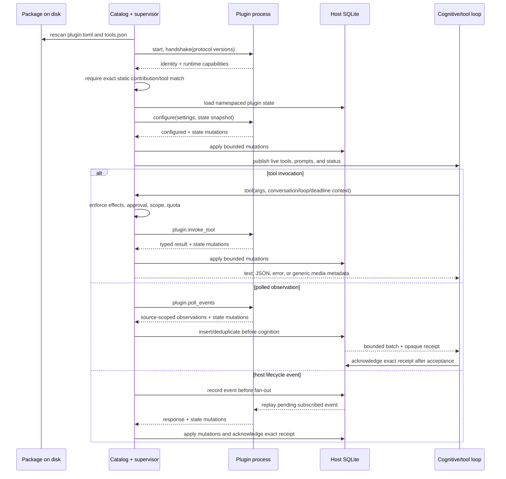

# Ponderer Plugin Architecture

## Intent

Ponderer plugins are installable capability packages. They give the agent new
senses, tools, event sources, and media providers without making those domains
part of the agent core. The host remains responsible for the durable temporal
record, canonical self, authority, lifecycle, and recovery.

"Orb" is a user-facing product name for a friendly or curated plugin. It is not
a separate runtime type or wire-protocol concept.

## Vocabulary

- **Plugin package**: Versioned installable unit with a manifest, schemas, code
  or declarative resources, and optional documentation.
- **Contribution**: A tool, event producer/subscription, prompt contribution,
  settings surface, or artifact/media capability exported by a package.
- **Runtime adapter**: Mechanism used to execute a package. Native subprocesses
  are supported first; sandboxed runtimes may implement the same contract.
- **Plugin manager**: Owns discovery, installation metadata, desired state, and
  configuration.
- **Plugin supervisor**: Reconciles desired and actual state, owns processes,
  health, restart policy, cancellation, and shutdown.
- **Capability grant**: Host-owned authority assigned to a plugin, optionally
  scoped by loop profile, resource, and quota.
- **Event ledger**: Durable ordered record delivered to plugins with replay
  cursors. It is part of Ponderer's relationship with time.
- **Plugin state**: Host-owned namespace for a plugin's durable checkpoints and
  data. It is distinct from Ponderer's canonical autobiographical state.

## Core Invariants

1. There is one logical plugin/package model regardless of execution adapter.
2. Package identity and static declarations have one source of truth: the
   versioned package manifest.
3. A handshake negotiates protocol compatibility and verifies identity; it does
   not silently redefine the package contract.
4. Effective authority is host-owned. In v1 it is derived from the static
   package request, semantic effect policy, loop profile, approval state,
   invocation scope, and quota; delegated package grants are a later extension.
5. A plugin cannot lower host approval, quota, or isolation requirements.
6. Native subprocesses are explicitly trusted and are not described as a
   sandbox boundary.
7. Plugin control-plane reconciliation continues while the cognitive loop is
   paused or busy.
8. Plugin events are namespaced, timestamped, versioned, durable, and replayable.
9. Plugin state is namespaced and host-owned. Until secret and artifact handles
   exist, the native adapter makes no stronger isolation claim for those data.
10. Prompt contributions are bounded, provenance-labelled, and restricted to
    statically declared slots. Per-kind grants for instruction and constraint
    contributions remain a policy extension.
11. Plugins may propose self-model changes or provide evidence. The host's
    reflection process decides what becomes canonical self-state.
12. Core code contains no Graphchan, ComfyUI, Voice-Orb, Image-Orb, or other
    plugin-domain policy after the relevant compatibility migration ends.

## Package Contract

Contract version 1 retains newline-delimited JSON request/response transport for
compatibility while making the wire schema explicit and versioned.

A package manifest declares:

- manifest and host-protocol versions;
- stable package ID, display name, package version, and description;
- runtime adapter and entrypoint;
- exported tools plus statically authorized hooks, prompt slots, and polling;
- requested capabilities and semantic effects; and
- settings schema metadata and the runtime entrypoint.

Tool names remain globally visible for protocol-v1 compatibility, but the host
binds each registration to one plugin ID and rejects conflicting or undeclared
runtime tools. An explicit `[contributions]` table opts into strict v1 authority,
including exact static schemas/effects for every runtime tool. Tool effects such
as `network.read`, `filesystem.write`, and `external.publish` drive host policy.

Strict admission requires `manifest_version = 1`, `protocol_version = 1`, and
`[contributions]` together. Omitting fields is not a package-selectable fallback:
the host has a temporary compiled allowlist for the exact `browser-orb`,
`image-orb`, and `voice-orb` ID/directory pairs while those bundled packages are
migrated. All other packages, including every workbench draft, must use the
strict path. Partially migrating an allowlisted package is rejected so static
authority cannot disappear accidentally.

Protocol v1 currently includes:

- handshake and protocol negotiation;
- configuration;
- health and graceful shutdown;
- tool invocation with invocation context and deadline;
- prompt contribution queries;
- polled observations plus host lifecycle-event delivery;
- host-owned state snapshots on configure and bounded state mutations in plugin
  responses; and
- structured errors.

The durable ledger receipt remains a host-side contract in v1: a plugin cannot
forge or advance it. Secret handles, artifact handles, plugin timers, explicit
cancellation, and a general plugin-to-host service channel are reserved protocol
extensions, not capabilities the current native adapter claims to provide.

## Runtime Data Flow



If the process exits or fails health checks, its dynamic tools are withdrawn,
status retains the failure, and restart reconciliation applies bounded backoff
and circuit behavior. A successful restart repeats handshake/configure, restores
host state, and replays unacknowledged subscribed events. Reconfiguration and
discovery continue while cognition is paused or occupied.

Protocol v1 does not pretend that subprocess memory and SQLite share a
distributed transaction. If a callback responds but its events, state, or
receipt cannot be durably accepted, the host withdraws that process generation
and supervised restart restores the last host-owned snapshot before replay.
External effects remain at-least-once and must use stable event IDs for
deduplication.

## Temporal Model

The event ledger records an event before fan-out. Each event includes a globally
unique event ID, type, schema version, source plugin or host component,
occurrence and record timestamps, correlation/causation metadata, and a typed
payload. Delivery is at least once; the host owns exact subscription cursors and
opaque delivery receipts separately from plugin-authored state.

On plugin start or restart, the host supplies the plugin's current state
snapshot. Polled observations and wired host lifecycle events are recorded
before delivery, replayed from durable host subscriptions, and acknowledged only
after the receiving path accepts the exact issued receipt. Ponderer's existing
schedule system remains host-owned; a dedicated plugin-timer service is future
work.

## Package and Data Layout

Development source, installed code, and mutable data are separate:

```text
plugins/                            tracked reference and portable packages
<config-dir>/plugins/store/         immutable staged package versions
<config-dir>/plugin-workbench/      model-authored drafts
SQLite plugin_state namespace      bounded durable plugin checkpoints
```

## Model-Authored Packages

The implemented native authoring lifecycle is:

```text
draft -> validate -> immutable stage (disabled)
```

The workbench deliberately cannot execute, grant, install-active, or enable a
package. New domains, secrets, sensors, external publication, native execution,
or other authority expansion therefore remains an operator-controlled step.
Automated conformance execution and activation within a delegated grant wait for
a real sandbox adapter.

Native subprocess packages remain available for explicitly trusted GPU,
browser, and hardware integrations. A sandboxed adapter is the intended default
for untrusted model-authored executable code.

## Implementation Status

Implemented in this v1 spine:

1. Shared versioned contract, static contribution authority, Python SDK, and
   conformance harness.
2. Pause-independent discovery reconciliation, live status, health checks,
   graceful shutdown, restart backoff, and circuit behavior.
3. Bounded host-owned state, durable observation/lifecycle ledgers, exact
   delivery receipts, replay, dead letters, and cursor-aware compaction.
4. Semantic effect policy, host-enforced approval minimums and outward quotas,
   and invocation context/deadline propagation.
5. Graphchan as the SDK reference plugin, with core Graphchan policy removed.
6. Generic settings and media presentation, with the disconnected ComfyUI and
   workflow extension paths removed.
7. A confined authoring workbench that validates and stages packages disabled.

Deferred extensions are explicit: migrate Browser, Image, and Voice packages to
the SDK; add secret/artifact handles and plugin timers; persist rolling outward
quotas across host restart; add a sandbox adapter and sandboxed conformance
runner; then add delegated activation, signing, dependency solving, and
distribution.

Marketplace distribution, dependency solving, signing infrastructure, and
persona-space measurement are deliberately deferred until this spine is
coherent and reliable.
